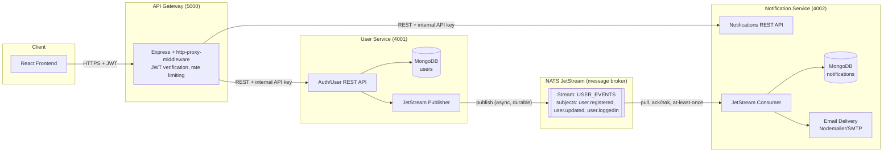

# Architecture

## Overview

The system has three independently deployable Node.js services:

| Service | Responsibility | Port |
|---|---|---|
| **API Gateway** | Single public entry point. Terminates client requests, validates JWTs, rate-limits, and reverse-proxies to internal services. | 5000 |
| **User Service** | Owns user data. Handles registration/login, issues JWTs, exposes profile CRUD. Publishes domain events. | 4001 |
| **Notification Service** | Owns notification data. Subscribes to user domain events and delivers/logs notifications (email). Exposes read endpoints for a user's notification history. | 4002 |

Neither backend service exposes REST/WebSocket endpoints to each other. All
inter-service communication is **asynchronous, event-driven, and broker-based**
via **NATS JetStream** — the User Service never knows the Notification Service
exists, and vice versa.

## Diagram

## Why NATS JetStream (not core NATS pub/sub)

Core NATS pub/sub is fire-and-forget: if the Notification Service is down
when an event is published, the message is lost. **JetStream** adds a
persistence layer on top of NATS so events satisfy the assignment's
"reliable, production-ready, asynchronous" requirement:

- **Durability** — events are written to a stream (`USER_EVENTS`) on disk,
  not just held in memory.
- **At-least-once delivery** — the Notification Service uses a **durable
  pull consumer** with explicit acknowledgement. If it crashes mid-processing,
  the un-acked message is redelivered on restart instead of being lost.
- **Retry with backoff** — a transient failure (e.g. Mongo hiccup, SMTP
  timeout) triggers a `nak()` with a backoff delay instead of dropping the
  event; JetStream redelivers automatically.
- **Poison-message handling** — after `MAX_DELIVER` (5) failed attempts,
  the message is `term()`inated instead of retried forever, so one bad
  event can never block the queue.
- **Replayability** — because events are persisted, a fresh consumer can
  replay history if needed for debugging or backfilling.

## Security model

1. **Client → Gateway**: JWT bearer token (HS256, short-lived) over HTTPS in
   production; the gateway is the only service that should be internet-facing.
2. **Gateway → services**: every proxied request carries a shared
   `x-internal-api-key` header. Both backend services reject any request
   missing this header, so calling them directly (bypassing the gateway)
   fails even if you somehow have network access to them. In a real
   deployment this is paired with network-level isolation (private
   subnet / service mesh / security groups) so the services are not
   internet-reachable at all — the header is defense-in-depth, not the
   only control.
3. **Gateway/services → NATS**: username/password authentication is
   required (`NATS_USER`/`NATS_PASSWORD`); the config also supports mutual
   TLS (`NATS_TLS_ENABLED=true` + cert paths) for production, and NATS
   accounts/permissions can further restrict which subjects each service
   may publish/subscribe to.
4. **Passwords**: hashed with bcrypt (cost factor 12), never logged or
   returned in API responses.
5. **Secrets**: all credentials (DB URIs, JWT secret, NATS credentials,
   SMTP credentials, internal API key) are read from environment
   variables — never hardcoded — see each service's `.env.example`.
6. **Input validation**: request bodies are validated with `zod` (User
   Service) before touching the database; invalid input returns `422`
   with field-level details instead of leaking stack traces.
7. **Rate limiting**: applied both at the gateway (global) and again on
   the auth endpoints specifically (stricter limit) to slow down
   credential-stuffing attempts.

## Scalability notes

- Each service is stateless (session state lives only in the JWT), so any
  of them can be horizontally scaled behind a load balancer without
  sticky sessions.
- JetStream durable consumers support multiple Notification Service
  replicas pulling from the same consumer group — messages are
  load-balanced across replicas automatically, with no duplicate
  processing beyond the normal at-least-once guarantee.
- MongoDB per service (database-per-service pattern) means each service's
  data store can be scaled/sharded independently and a schema change in
  one service can never break another.
- The gateway is a thin proxy with no business logic, so it scales
  trivially and can be replaced with a managed API gateway (Kong, AWS API
  Gateway, etc.) later without touching the services.
